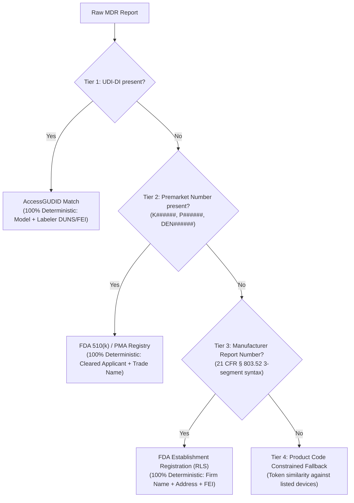

<div align="center">

# Spotlight (spotlight-nlp)

**High-Throughput Clinical NLP Extraction Library for FDA MAUDE Medical Device Narratives**

[](https://www.python.org/downloads/)
[](https://opensource.org/licenses/Apache-2.0)
[]()
[]()
[](https://www.imdrf.org/)

</div>

---

## Overview

The United States FDA **MAUDE** (Manufacturer and User Facility Device Experience) database houses over **26 million** adverse event reports describing medical device malfunctions, patient injuries, and deaths. However, the critical regulatory and clinical intelligence—what went wrong, what physical component broke, which clinical injury occurred, and what emergency surgery was required—is buried within unstructured, noisy free-text narratives contaminated with legal boilerplate and redactions (`(b)(4)`, `(b)(6)`).

**Spotlight** is a production-grade, computationally efficient Python library and CLI engineered to ingest FDA MAUDE narratives and output structured, ground-truth clinical extractions across 5 discrete categories:

1. **Operational Problems**: Device failure modes during active use (*IMDRF Annex A*).
2. **Manufacturing Issues**: Pre-use defects, packaging breaches, and foreign particulate (*IMDRF Annex C*).
3. **Patient Adverse Events**: Physiological injury, tissue damage, hemodynamic collapse, and death (*IMDRF Annex E / MedDRA*).
4. **Clinical Interventions**: Rescue surgeries, bail-out stenting, fragment retrievals, blood transfusions, and prolonged anesthesia (*IMDRF Annex F*).
5. **Other Issues**: Shipping damage, transit delays, off-label usage, and user handling errors.

---

## Key Features

- **Deterministic High-Throughput Engine**:
  - Sub-millisecond preprocessing, boilerplate stripping, greedy non-overlapping span extraction, and negation masking. Average CPU latency of **5–15 ms per record** (~150 records/sec/core).
- **Durable Extraction Store (SQLite)**:
  - Persist, resume, and continually compile extraction findings across millions of records without reprocessing. Supports lossless roundtrip serialization of Pydantic models.
- **Orchestrated Delta Pipeline**:
  - Memory-constant streaming chunk processing with automated SQL anti-joins (`skip_already_extracted`) to query, extract, and save only delta records with zero redundant compute.
- **Granular Regulatory Grounding (IMDRF 2026 & MedDRA)**:
  - Eliminates ontology collapse by providing Level 3/4 code distinctions (e.g. separating complete fractures `A040101` from surface cracks `A0404`, balloon bursts `A0414`, misfires `A050502`, and cutting failures `A050702`).
- **Anatomical Component Linkage (IMDRF Annex G)**:
  - Syntactically binds physical device components (e.g. `sheath hub`, `polyaxial tulip collar`, `hemostasis valve junction`) directly to their specific failure predicate.
- **Entity Resolution & Deduplication**:
  - Resolves acronym coreferences (e.g., `coronary artery bypass graft` vs. `CABG`) while preserving multi-aspect physical manifestations that share parent ontology branches.
- **Direct openFDA & Offline MDR Database**:
  - Out-of-the-box support for querying the official openFDA API and syncing historical FDA MDR flat files with automatic download caching and delta checks.
- **Native Vigipy Integration**:
  - Disproportionality surveillance bridge compiling extractions directly into `vigipy.DataContainer` objects for PRR, ROR, GPS, BCPNN, and multivariable LASSO regressions.
- **Zero Heavyweight Runtime Dependencies**:
  - Core library runs entirely on pure Python and Pydantic v2—no neural model weights, PyTorch, or GPU required. Optional experimental LLM modules are strictly decoupled.

---

## Installation

### From Source or Git Repository
```bash
git clone https://github.com/spotlight-nlp/spotlight.git
cd spotlight
pip install .
```

### For Development & Testing
```bash
pip install -e ".[dev]"
```

### With Optional LLM Fallback Dependencies
```bash
pip install -e ".[llm]"
```

### With Vigipy Disproportionality Surveillance Integration
```bash
pip install -e ".[vigipy]"
```

---

## Quickstart (Python API)

### 1. One-Liner Narrative Extraction
```python
import spotlight

narrative = (
    "During laparoscopic colectomy, the surgical stapler misfired across the mesenteric vessels "
    "and demonstrated complete failure to cut. The jammed jaw caused severe tissue laceration and "
    "acute hemorrhage. The surgical team performed an emergent exploratory laparotomy to achieve "
    "hemostasis. The patient received a blood transfusion of 2 units of PRBC and required prolonged anesthesia time."
)

result = spotlight.extract(narrative, brand_name="Articulating Stapler")

# Access structured operational problems
for problem in result.operational_problems:
    print(f"[{problem.id}] {problem.verbatim_span} | Component: {problem.affected_component}")
    for term in problem.normalized_terms:
        print(f"     -> IMDRF Annex A: {term.code} ({term.preferred_term})")

# Access adverse events
for ae in result.adverse_events:
    print(f"[{ae.id}] {ae.verbatim_span}")
    for term in ae.normalized_terms:
        print(f"     -> IMDRF Annex E: {term.code} ({term.preferred_term})")

# Access clinical rescue interventions
for intv in result.clinical_interventions:
    print(f"[{intv.id}] {intv.verbatim_span} (Triggered by: {intv.triggered_by})")
    for term in intv.normalized_terms:
        print(f"     -> IMDRF Annex F: {term.code} ({term.preferred_term})")
```

### 2. Batch Processing with High Throughput
```python
import spotlight

narratives = [
    "Prior to surgery, visible dark particulate matter was identified adhering to the implant.",
    "During PCI, the balloon burst under 14 atm causing acute coronary dissection. Emergency covered stent placed.",
    "Catheter shaft fractured during advancement. Snare catheter retrieval performed to extract fragment.",
    "Routine infusion completed with no patient injury and no adverse events.",
]

# Processes records sequentially or concurrently
results = spotlight.extract_batch(narratives)

for i, res in enumerate(results, 1):
    print(f"Report {i}: Processed in {res.processing_time_ms:.2f} ms via {res.execution_path.value}")
### 3. Disproportionality Surveillance with Vigipy
Spotlight natively bridges into [Vigipy](https://github.com/Shakesbeery/vigipy) (v3.0+) for multi-device signal detection:

```python
import spotlight
from spotlight import to_vigipy_df, to_vigipy_container, run_disproportionality_scan
import vigipy

# 1. Process batch of device records
outputs = spotlight.extract_batch(records)

# 2. Convert to transaction DataFrame or typed DataContainer
df = to_vigipy_df(outputs, product_key="brand_name", target_level="code_term")
container = to_vigipy_container(outputs, product_key="brand_name", margin_threshold=1)

# 3. One-line disproportionality scan across frequentist & Bayesian algorithms
results = run_disproportionality_scan(outputs, methods=["prr", "ror", "bcpnn", "gps"])

print("PRR Signals:", results["prr"].num_signals)
print("ROR Signals:", results["ror"].num_signals)

# 4. Multivariable LASSO Analysis with Sparse Binary Matrices
binary_container = to_vigipy_container(outputs, binary=True, sparse=True)
lasso_res = vigipy.lasso(binary_container, min_events=1, relaxed=True)
print(lasso_res.all_signals[["Product", "Adverse Event", "Count", "aROR", "CI Lower", "CI Upper"]])
```

### 4. Fetching Real-World Data from openFDA
```python
from spotlight import MAUDEDataFetcher, SpotlightExtractor

fetcher = MAUDEDataFetcher(data_dir="data")

# Queries live openFDA Device Event API
records = fetcher.fetch_openfda_records(
    limit=10,
    event_type="Injury",
    query='(mdr_text.text:"perforation" OR mdr_text.text:"dissection")'
)

extractor = SpotlightExtractor()
outputs = extractor.process_batch(records)

print(f"Successfully processed {len(outputs)} real FDA records.")
```

### 5. Managing Direct FDA MAUDE Flat Files Database (`mdr_database`)
If you require the entire historical MDR dataset or large multi-year cohorts beyond the 25k openFDA API ceiling:

```python
import spotlight
from spotlight import MDRDatabase, init_mdr_database

# 1. Initialize or sync local database directly from FDA ftparea
db = init_mdr_database(
    db_path="data/maude.db",
    years=[2024, 2025],  # or "recent", or "all"
    sync=True,           # Downloads, extracts ZIPs, and ingests pipe-delimited files
)

# 2. Check database statistics (master reports, devices, and durable extraction store)
stats = db.stats()
print(f"Total Master Reports: {stats['master_reports']:,}")
print(f"Total Device Records: {stats['device_records']:,}")

# 3. Stream millions of joined records in constant memory (<100MB RAM)
# Tip: event_type=None (or "all") returns all event types (Malfunctions, Injuries, Deaths)
for record in db.stream_records(product_code="GAG", event_type=None, limit=1000):
    output = spotlight.extract(record)

# 4. Orchestrate an automated Query -> Extract -> Save delta pipeline
# Automatically anti-joins against previously saved extractions so only unextracted delta records are processed!
run_stats = db.orchestrate_pipeline(
    product_code="GAG",
    event_type=None,         # Processes all event types
    chunk_size=500,          # Streams & commits in memory-constant 500-record batches
    skip_already_extracted=True,  # Zero redundant compute on re-runs!
)
print(f"Newly Extracted: {run_stats.newly_extracted:,} | Saved: {run_stats.total_findings_saved:,}")

# 5. Compile stored results directly into Vigipy for disproportionality scanning
vdf = db.to_vigipy_df(product_code="GAG", target_level="code_term")
container = db.to_vigipy_container(product_code="GAG", binary=True)
```

### 6. Isolated Multi-Project Workspaces (`SpotlightProject`)
For real-world postmarket research, researchers typically work on multiple clinical studies, indications, or device classes concurrently (e.g. coronary stents vs. surgical staplers). `SpotlightProject` provides isolated project workspaces that share a central, read-only raw MDR database while maintaining completely separate extraction stores, manifests, delta tracking, and exports.

#### Workspace Structure
```
projects/
└── surgical_staplers/
    ├── project.json      # Metadata manifest, config, and audit trail of pipeline runs
    ├── extractions.db    # Isolated durable extraction store (<50MB)
    └── exports/          # Project-specific Parquet/CSV Vigipy datasets
```

#### Python API & Live Session Guardrails
```python
import spotlight
from spotlight import SpotlightProject, ProjectMismatchError, ProjectActiveConflictError

# 1. Initialize or open an isolated project workspace
with SpotlightProject("surgical_staplers", raw_db="data/maude.db", description="Endocutter failure study") as proj:
    print(f"Active Project: {proj.name} ({proj.project_dir})")

    # 2. Run a project-scoped delta pipeline
    # Queries shared raw MDR database and anti-joins strictly against THIS project's extractions
    stats = proj.orchestrate_pipeline(
        product_code="GAG",
        event_type=None,
        skip_already_extracted=True,  # Only processes delta records not yet in this project
    )
    print(f"Newly Extracted: {stats.newly_extracted:,} | Findings Saved: {stats.total_findings_saved:,}")

    # 3. Compile project findings directly to Vigipy
    vdf = proj.to_vigipy_df(target_level="code_term")
    container = proj.to_vigipy_container(binary=True)
    export_path = proj.export_vigipy_dataset("staplers.parquet")

    # 4. Lookup raw MDR metadata on demand from any extracted finding
    meta = proj.get_raw_metadata("12345678")
    print(f"Manufacturer: {meta['manufacturer_name']} | Event: {meta['event_type']}")

# Contamination Guard in live interactive sessions (e.g. Jupyter):
p_balloons = SpotlightProject("balloon_catheters")
p_staplers = SpotlightProject("surgical_staplers")

# Extractions are automatically tagged with the active project:
stapler_findings = spotlight.extract("Stapler misfired during resection.")

# Attempting to save findings tagged for 'surgical_staplers' into 'balloon_catheters' raises:
# ProjectMismatchError: Cross-project contamination prevented! Report belongs to 'surgical_staplers', but active project is 'balloon_catheters'.
try:
    p_balloons.save_extractions([stapler_findings])
except ProjectMismatchError as e:
    print("Contamination prevented!")
```

### 7. Optional Device & Manufacturer Registry Linker (`device_registry`)
Because raw FDA MDR narratives and voluntary reports frequently contain typos, trade names, or colloquial terms, associating a report with an official FDA-registered device and legal manufacturer can be ambiguous. Spotlight includes a dedicated, completely optional **4-tier waterfall resolution engine** (`DeviceRegistryLinker`):



#### Python Usage
```python
from spotlight import DeviceRegistryLinker, MatchTier

# 1. Initialize linker (runs in-memory or on persistent SQLite)
linker = DeviceRegistryLinker()
linker.seed_mock_registry()  # Or ingest official FDA flat files: linker.ingest_establishment_file(...)

# 2. Resolve a report carrying a UDI-DI (Tier 1: Deterministic)
res1 = linker.resolve_report(
    mdr_report_key="R-100",
    udi_di="00884521034812",
    brand_name="Endocutter 60",
)
print(res1.match_tier)          # MatchTier.TIER_1_UDI
print(res1.is_affirmative)      # True (100% deterministic)
print(res1.manufacturer.name)   # "Ethicon Endo-Surgery, LLC"
print(res1.device.listing_number) # "D201452"

# 3. Resolve a report carrying a 510(k) / PMA number (Tier 2: Deterministic)
res2 = linker.resolve_report(
    mdr_report_key="R-200",
    pma_pmn_num="P160002",
    brand_name="Coronary Stent",
)
print(res2.match_tier)          # MatchTier.TIER_2_PREMARKET
print(res2.manufacturer.name)   # "Medtronic Vascular"
print(res2.device.proprietary_name) # "Resolute Onyx Zotarolimus-Eluting Coronary Stent System"

# 4. Resolve a report via 21 CFR § 803.52 Report Number (Tier 3: Deterministic)
res3 = linker.resolve_report(
    mdr_report_key="R-300",
    report_number="2183427-2024-00192",  # 2183427 is Medtronic Vascular FEI/Registration No.
)
print(res3.match_tier)          # MatchTier.TIER_3_REPORT_NUMBER
print(res3.manufacturer.name)   # "Medtronic Vascular"

# 5. Batch resolve an entire local MDR database (non-destructive)
# Saves results into a dedicated 'report_registry_links' table
stats = linker.link_mdr_database(db, verbose=True)
print(f"Affirmative matches: {stats['affirmative_matches']:,} / {stats['total_records_analyzed']:,}")
```

---

## Command-Line Interface (CLI)

Spotlight includes a complete CLI:

### Analyze a Single Narrative
```bash
spotlight extract "During catheterization, the balloon burst under pressure causing arterial dissection."
```

### Output JSON to stdout or file
```bash
spotlight extract "Balloon burst under pressure." --json
```

### Batch Ingest a File of Records
```bash
spotlight batch input_records.json -o extracted_findings.json
```

### Fetch Live FDA Reports from openFDA API
```bash
spotlight fetch --limit 20 --event-type Malfunction -o live_malfunctions.json
```

### Manage Offline FDA MDR Flat Files Database & Durable Pipeline
```bash
# Download and ingest recent years into local SQLite database
spotlight mdr sync --years 2024,2025 --db data/maude.db

# Inspect database contents and durable extraction store statistics
spotlight mdr stats --db data/maude.db

# Query records directly (with optional delta filter)
spotlight mdr query --product-code GAG --limit 10 --db data/maude.db
spotlight mdr query --product-code GAG --unextracted-only --db data/maude.db

# Orchestrate streaming extraction & save to durable store (skipping previously processed)
spotlight mdr extract --product-code GAG --event-type all --db data/maude.db
```

### Manage Isolated Project Workspaces (`spotlight project`)
```bash
# 1. Create a new study project workspace (links to shared raw database)
spotlight project create surgical_staplers --raw-db data/maude.db --desc "Endocutter safety study"

# 2. List all active project workspaces on disk
spotlight project list

# 3. Run streaming extraction pipeline strictly scoped to the project
# Queries data/maude.db and anti-joins against projects/surgical_staplers/extractions.db
spotlight project extract surgical_staplers --product-code GAG

# 4. View project statistics and extracted finding breakdown
spotlight project stats surgical_staplers

# 5. Export compiled project findings to CSV or Parquet for Vigipy
spotlight project export surgical_staplers -o staplers_vigipy.csv
```

### Check Installed Version
```bash
spotlight version
```

---

## Architecture

```
                  ┌──────────────────────────────────────────────┐
                  │          Raw FDA MAUDE Narrative             │
                  └──────────────────────┬───────────────────────┘
                                         │
                                         ▼
                  ┌──────────────────────────────────────────────┐
                  │          Stage 1: Preprocessor               │
                  │  • Strip CFR 803 & manufacturer disclaimers  │
                  │  • Remove (b)(4) & (b)(6) redaction tokens   │
                  │  • Segment clauses & tag temporal timing     │
                  │  • Filter negated clinical contexts          │
                  └──────────────────────┬───────────────────────┘
                                         │
                                         ▼
                  ┌──────────────────────────────────────────────┐
                  │    Stage 2: Deterministic Span Triage        │
                  │  • Greedy longest-match span extraction      │
                  │  • Sub-millisecond CPU execution (~10ms)     │
                  │  • Classify failure & event candidate spans  │
                  └──────────────────────┬───────────────────────┘
                                         │
                                         ▼
                  ┌──────────────────────────────────────────────┐
                  │    Stage 3: IMDRF & MedDRA Grounding         │
                  │  • Annex A (Device Operational Problems)     │
                  │  • Annex C (Pre-Use / Manufacturing Issues)  │
                  │  • Annex E (Patient Adverse Events)          │
                  │  • Annex F (Clinical Rescue Interventions)   │
                  └──────────────────────┬───────────────────────┘
                                         │
                                         ▼
                  ┌──────────────────────────────────────────────┐
                  │    Stage 4: Component Linker & Deduplication │
                  │  • Syntactically bind physical components    │
                  │  • Resolve acronym coreferences (CABG)       │
                  │  • Attribute interventions to adverse events │
                  └──────────────────────┬───────────────────────┘
                                         │
                                         ▼
                  ┌──────────────────────────────────────────────┐
                  │   Stage 5: Output & Persistence Layer        │
                  │  • Typed Pydantic MAUDEExtractionOutput      │
                  │  • Durable Extraction Store (SQLite WAL)     │
                  │  • Direct Vigipy Disproportionality Bridge   │
                  └──────────────────────────────────────────────┘
```

---

## Regulatory Ontology Grounding Reference

Spotlight maps free-text clinical and engineering mentions directly into the latest **2026 IMDRF Harmonized Adverse Event Terminology**:

| Category | Example Mentions | IMDRF Code | Preferred Term |
| :--- | :--- | :--- | :--- |
| **Operational Problem** | `"hub was fractured"`, `"collar broke"` | **`A040101`** | Fracture |
| **Operational Problem** | `"hub cracked"`, `"hairline crack"` | **`A0404`** | Crack |
| **Operational Problem** | `"balloon burst under pressure"` | **`A0414`** | Material Split, Cut or Torn |
| **Operational Problem** | `"detached into epidural space"` | **`A0501`** | Detachment of Device or Device Component |
| **Operational Problem** | `"stent dislodged from balloon"` | **`A051201`** | Device Dislodged or Dislocated |
| **Operational Problem** | `"misfired across vessels"` | **`A050502`** | Misfire |
| **Operational Problem** | `"failure to cut"` | **`A050702`** | Failure to Cut |
| **Operational Problem** | `"stapler jammed"` | **`A0506`** | Mechanical Jam |
| **Manufacturing Issue** | `"visible dark particulate matter"` | **`C1901`** | Foreign Material / Particulate |
| **Manufacturing Issue** | `"crack in inner sterile barrier tray"` | **`C0202`** | Seal Integrity / Sterile Barrier Compromised |
| **Manufacturing Issue** | `"sealing cap was loose"` | **`C0102`** | Loose / Disassembled Component |
| **Adverse Event** | `"mesenteric tissue laceration"` | **`E2101`** | Tissue Laceration |
| **Adverse Event** | `"unintended dural tear"` | **`E2103`** | Tissue / Dural Tear |
| **Adverse Event** | `"vessel perforation"` | **`E2114`** | Perforation |
| **Adverse Event** | `"acute hemorrhage"`, `"severe bleeding"` | **`E0506`** | Hemorrhage / Bleeding |
| **Adverse Event** | `"sudden hemodynamic instability"` | **`E0401`** | Hypotension / Shock / Hemodynamic Instability |
| **Adverse Event** | `"acute coronary dissection"` | **`E2401`** | Vascular Dissection |
| **Clinical Intervention**| `"snare catheter retrieval of fragment"`| **`F1903`** | Device Explantation / Fragment Retrieval |
| **Clinical Intervention**| `"coronary artery bypass graft (CABG)"` | **`F1901`** | Surgical Revision / Revascularization |
| **Clinical Intervention**| `"emergency exploratory laparotomy"` | **`F19`** | Surgical Intervention |
| **Clinical Intervention**| `"emergency covered stent"` | **`F1905`** | Rescue / Bailout Percutaneous Stenting |
| **Clinical Intervention**| `"transfusion of 2 units of PRBC"` | **`F2302`** | Blood Product Transfusion |
| **Clinical Intervention**| `"prolonged anesthesia time"` | **`F1908`** | Prolonged Surgery / Extended Procedure |
| **Clinical Intervention**| `"fluid resuscitation & vasopressors"` | **`F2301`** | Pharmacological / Medical Support |

---

## Verification & Benchmarks

The entire test suite can be run via `pytest`:

```bash
pytest tests/ -v
```

### Benchmark Summary (Single CPU Core)
- **Fast-Path Latency**: **5.8 ms – 19.4 ms** per narrative.
- **Throughput**: **100 – 150 records / second / core**.
- **Memory Overhead**: < 150 MB peak resident set size.
- **Test Suite**: **62 passing tests** covering preprocessing, token triage, component linkage, acronym reconciliation, ontology disambiguation, openFDA fetching, MDR database delta ingestion, durable extraction store, metadata lookups, Vigipy bridge, and CLI commands.

---

## Experimental & Research Modules (Optional SLM & Distillation)

> [!NOTE]
> The core Spotlight extraction pipeline is 100% deterministic and runs locally on CPU with zero neural model weights or cloud API calls. The modules below are optional experimental interfaces intended for advanced research and custom model exploration.

### Edge SLM Fallback Interface (`spotlight.llm_fallback.Gemma4FallbackEngine`)
- An optional fallback class designed to interface with an external OpenAI-compatible inference server (e.g. vLLM, Ollama, or llama.cpp) hosting open-weight models (such as Gemma 4 2B, 4B, 12B, or 26B).
- If no endpoint URL is specified, this engine uses a deterministic testing mock and will never attempt network requests or weight downloads.

### Frontier Teacher Distillation Template (`spotlight.llm_fallback.Gemini38FlashDistillationClient`)
- A prompt-formatting scaffold designed for structuring chain-of-thought extraction prompts for frontier LLM APIs (e.g. Google AI Studio) when generating synthetic training datasets. This is currently a prompt-template interface and does not include training loops or fine-tuning pipelines.

---

## Open Source License & Compliance Review

- **Library License**: Distributed under the permissive **Apache License, Version 2.0** (`LICENSE`). Free for both commercial and academic integration.
- **Dependencies**: All core dependencies (`pydantic`, `pytest`, `pluggy`, etc.) use permissive OSI-approved licenses (MIT, BSD-3, PSF). There are **zero GPL / AGPL copyleft dependencies**.
- **Public Domain Data**:
  - FDA MAUDE data and openFDA APIs are works of the United States Government under 17 U.S.C. § 105 and reside in the public domain.
  - IMDRF adverse event terminologies are harmonized international regulatory standards published freely for post-market surveillance.

---

## Contributing

Contributions are welcome! Please feel free to open an issue or submit a pull request on GitHub.

```bash
git checkout -b feature/my-feature
pytest tests/ -v
git commit -m "Add feature"
```
